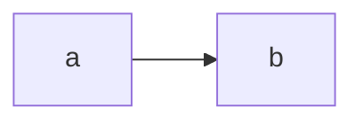

# Code Walk

A walk is a Markdown file. Fenced blocks whose info string starts with `show` or `diff` are **git arguments**; the server renders the real code/diff. Never paste code into a walk — reference it.

CLI: `code-walk` (if missing: `npx -y github:jeffbaumes/code-walk <command>`).

## Workflow

1. `code-walk outline main...HEAD` — changed files, hunks (`hunk=N`, line ranges) and commits, printed as block lines. Copy from it; don't guess line numbers.
2. Write the walk to `.code-walk/<short-name>.md` in the repo (or a temp dir for other people's repos). Start it, right after the frontmatter, with the viewing hint (below).
3. `code-walk check .code-walk/<short-name>.md` — fix every error it reports.
4. `code-walk serve .code-walk/<short-name>.md --open` (run in the background). The page live-reloads on save, so later edits just need a save. Give the user the printed URL.

## Viewing hint

Anyone who opens the raw `.md` (on GitHub, in an editor, in a diff) sees only fenced git arguments. Begin every walk, right after the frontmatter, with this blockquote so they know how to view it, using the walk's real path:

````md
> 📖 **Code Walk** — a guided tour whose code is git references, so this file looks sparse as plain text. To view it, run `npx -y github:jeffbaumes/code-walk serve .code-walk/<short-name>.md` ([code-walk](https://github.com/jeffbaumes/code-walk)).
````

The viewer doesn't render this quote, and `code-walk check` warns if it's missing.

## Block syntax

The info string is `show`/`diff` arguments, then an optional line selection. Refs are anything git accepts (sha, branch, tag, `HEAD~2`).

````md
```show main:src/limiter.ts L20-48          ← file at a commit (L20 = one line)
```
```show :src/limiter.ts                     ← staged version
```
```show src/limiter.ts L5-9                 ← working-tree file
```
```show a1b2c3d                             ← commit: message + full diff
```
```show a1b2c3d -- src/limiter.ts           ← one file's changes in a commit
```
```diff main...feature -- src/router.ts     ← PR-style diff (from merge base)
```
```diff main..feature -- src/router.ts R14-19   ← new-side lines 14-19
```
```diff main..feature -- src/router.ts L3-9     ← old-side lines
```
```diff main..feature -- src/router.ts L14-R19  ← old line 14 through new line 19
```
```diff main...feature -- src/router.ts hunk=2  ← 2nd hunk (numbering from outline)
```
```diff --cached -- src/x.ts                  ← HEAD → staged
```
```diff -- src/x.ts                           ← staged → working tree (git's bare diff!)
```
```diff HEAD -- src/x.ts                      ← HEAD → working tree (all uncommitted)
```

````

## Summaries (`--stat`)

Add `--stat` to any `diff` or `show <commit>` block to render a summary instead of code: files with status, +/− counts and change bars, plus commit count and totals. Numbers come from git on every render; never type stats into prose. Use as many as helpful (whole branch, per commit, one directory).

The optional body groups files. `files` is a glob, a list of globs, or a map glob → note. The first matching group wins; `dir/` means everything under it; unmatched files land in **Ungrouped**, so nothing is hidden. Each group gets a subtotal.

````md
```diff --stat main...feature
- group: Backend
  note: Token bucket and its wiring
  files:
    src/limiter.ts: New in-memory token bucket
    src/**: Other server changes
- group: Tests
  files: [test/, "**/*.test.ts"]
```
````

Files in a summary link to their snippets elsewhere in the walk. `check` warns about patterns that match nothing.

## Block notes

- Without `-- <path>` a diff shows every changed file. Line selections need exactly one file.
- Optional block body: `highlight: 29-30` (new side / file lines; `L12-13` for the old side).
- Repos can be git URLs (`repo: https://github.com/owner/name`, or as `repos:` values). Code Walk clones into a cache and refs like `main`, `feature/x` and tags work; staged and working-tree blocks don't. Use this for other people's repos instead of cloning by hand.
- Multiple repos: declare them in frontmatter, pick with `-C <name>` (first is default):

```yaml
---
title: Rate limiting across gateway and SDK
repos:
  gateway: ..          # paths relative to the walk file
  sdk: ../../client-sdk
---
```

````md
```diff -C sdk main...feature -- src/retry.ts
```
````

## Writing a good walk

- Start with a grouped `diff --stat` of the whole change, 1–3 sentences on what changed and why, then a `mermaid` diagram if more than a couple of components interact.
- Order sections by concept (data model → core logic → wiring → tests), not by file list.
- Prefer focused snippets (a hunk or 5–40 lines) over whole files; use `highlight:` for the lines that matter.
- Prose explains *why* and what to notice; the snippet shows *what*. Keep paragraphs short.
- For review, prefer commit refs (branches/shas). Staged and working-tree refs change as files are edited.
- End with anything skipped (generated files, trivial renames) and open questions.

## Review comments

The user can select lines in the page and leave comments (`c`). When they say something like "I left some comments", "address my review comments" or "make the changes from the walk":

1. `code-walk comments` (run in the repo). It finds the walk on its own and prints each open comment with its id, file, line range, section, the exact lines it's attached to, and the thread so far. Use `--all` to include resolved ones, or pass a walk path if nothing is found.
2. Handle each comment:
   - Anchors point at the walk's refs (often a commit). When changing code, edit the current working-tree file. Its line numbers may differ, so find the quoted lines.
   - If a comment asks a question or you disagree, reply without `--resolve` and let the user decide.
3. Reply to each one. The page updates live.

   ```bash
   code-walk comments reply <id> "Changed X to Y in src/router.ts" --resolve
   ```

4. If your changes should appear in the walk, update its references (for example, switch to `diff HEAD -- <path>`) and run `code-walk check` again.

To draft a review for the user to edit, write a walk over the change, run `check`, then attach each point to exact lines. The reference is a block info string ending in a range that the walk shows.

```bash
code-walk comments add --walk .code-walk/review.md "diff main...feature -- src/router.ts R14-16" "question: where does clientId come from?"
```

When the user replies to one of your draft comments with an instruction (for example "shorten this"), edit the comment, then add a short reply confirming the change. Don't resolve drafts the user still plans to post.

```bash
code-walk comments edit <id> --old "<exact current text>" --new "<replacement>"
```

Edits work like a string-replace file edit. `--old` must match the current text exactly once, so run `code-walk comments` first. If the user changed the comment since you last read it, the edit is refused and the current text is printed; re-read it and retry rather than overwriting. To rewrite the whole message, pass the whole current text as `--old`. `--reply <reply-id>` edits a reply instead; reply ids appear in the listing as `↳ [id]`.

Keep each comment to one point. Use labels like `nit:` and `question:`, and write them so they can be posted as-is.

Comments live next to the walk in `<walk>.comments.json`.

## Reading a pasted Code Walk URL

`http://localhost:4747/w/<walk>#<git args, + for spaces>&<selection>`

- `#show+a1b2c3d4e5f6:src/limiter.ts&L29-30` → `git show a1b2c3d4e5f6:src/limiter.ts`, lines 29–30.
- `#diff+2b88ce2dbf1f..de7efebec33f+--+src/router.ts&L14-R19` → that diff; L = old-side line numbers, R = new-side.
- `#diff+--cached+de7efebec33f+--+src/x.ts&R3-4` → commit vs staged; `#diff+--+src/x.ts` → staged vs working tree; `#show+src/x.ts` → working-tree file.
- `-C+<name>+…` → repo `<name>` from the walk's frontmatter (walk file is usually `.code-walk/<walk>.md`).
- `#comment-<id>` → a review comment. Run `code-walk comments --all` and find that id.

Fastest: `code-walk resolve '<url>'` prints the referenced lines (selected lines marked `>`), with sides and the repo path.
